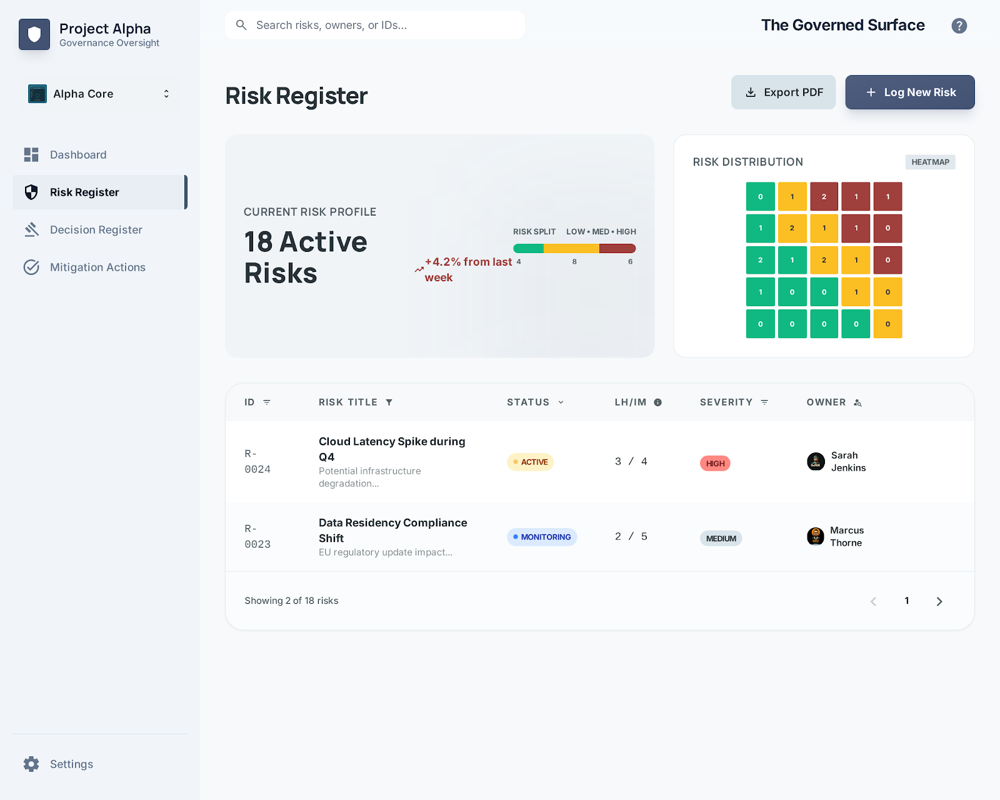
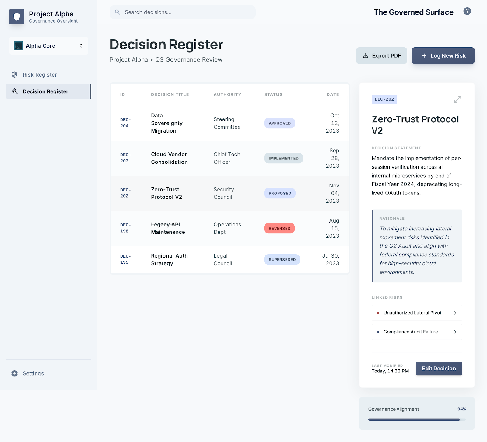

# Governance Register

Governance Register is a local-first risk and decision workspace built for teams that need a simple, governed way to manage:

- a risk register
- a decision register
- portable review snapshots

It starts with a blank project for real use and supports import/export of pretty JSON snapshots so teams can collaborate without needing a networked backend.

## Highlights

- Risk register with scoring, ownership, linked decisions, mitigation planning, and history
- Decision register with rationale, linked risks, consequences, and status tracking
- Snapshot import/export workflow for restricted environments such as SharePoint-based collaboration
- Portable launchers for Mac and Windows
- Bundled demo snapshot for walkthroughs and training

## Screenshots

### Risk Register



### Decision Register



## Run Without Setup

This repository includes a production build that can be launched without `npm run dev`.

### Recommended Download Flow

1. Download or clone the repository
2. Keep the folder structure intact
3. Launch the app from the repository root using the platform launcher below

This works because the portable build is already included under `app/dist/`.

### Mac

Double-click `Launch Governance Register.command`

If macOS warns that the file came from the internet, use the normal security prompt flow to allow it to open.

### Windows

Double-click `Launch Governance Register.bat`

These launchers open the built app from `app/dist/index.html` in the default browser.

### What To Expect

- No package installation is required for normal use
- No backend or database is required
- The app runs in the browser, but from local files included in this repo
- Your working data stays local unless you export and share a snapshot yourself

For more portable-launch notes, see [docs/portable-app.md](docs/portable-app.md).

## Demo Content

The app starts with a blank project by default.

To load example content for demos or training:

1. Open the app
2. Go to `Import / Export`
3. Download the bundled demo snapshot
4. Import that snapshot into the app

The bundled demo snapshot is included in the portable build so users can explore a populated example without affecting the default blank starting state.

## Release Use On GitHub

For GitHub visitors, the simplest path is:

1. Download the repository as a ZIP or clone it
2. Extract it to a normal local folder
3. Launch with `Launch Governance Register.command` on Mac or `Launch Governance Register.bat` on Windows

If you plan to share the tool internally, distributing the full repository contents is important because the launchers expect the built app to remain at `app/dist/index.html`.

## Development

The source app lives under `app/`.

### Local development

```bash
cd app
npm install
npm run dev
```

### Build

```bash
cd app
npm run build
```

### Type check

```bash
cd app
npm run lint
```

## Repository Layout

- `app/`: source app and production build
- `docs/`: portable launch notes, screenshots, and archived planning/reference material
- `Launch Governance Register.command`: Mac launcher
- `Launch Governance Register.bat`: Windows launcher

## Notes

- The portable launch path is intentionally browser-based rather than Electron for a lighter-weight distribution model.
- The built app is checked into the repository on purpose so end users can launch it directly from the repo contents.
